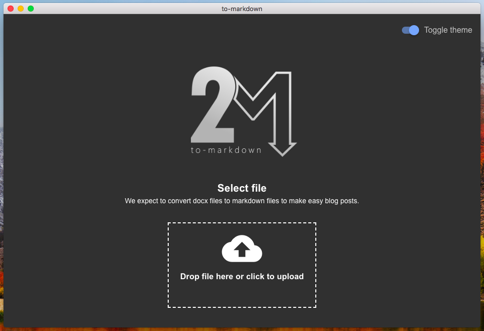

<p align="center">
	
</p>

<p align="center">
	<a href="https://travis-ci.org/LagartijaDevelopment/to-markdown">
		
	</a>
	<a href="https://greenkeeper.io/">
		
	</a>
	<a href="https://snyk.io/test/github/LagartijaDevelopment/to-markdown?targetFile=package.json">
		
	</a>
</p>

#### Description
Simple Electron application to convert docx files to markdown format

#### Screenshot


#### Build Setup

``` bash
# install dependencies
yarn install

# serve electron app on dev environment with devTools
yarn run dev

# build electron application for production
yarn run build

# run unit & end-to-end tests
yarn test

# lint all JS/Vue component files in `src/`
yarn run lint

```

